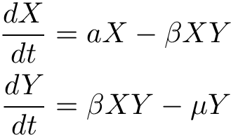
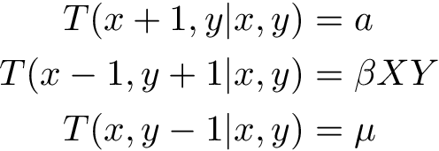
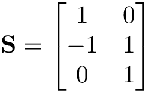
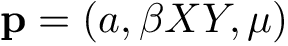
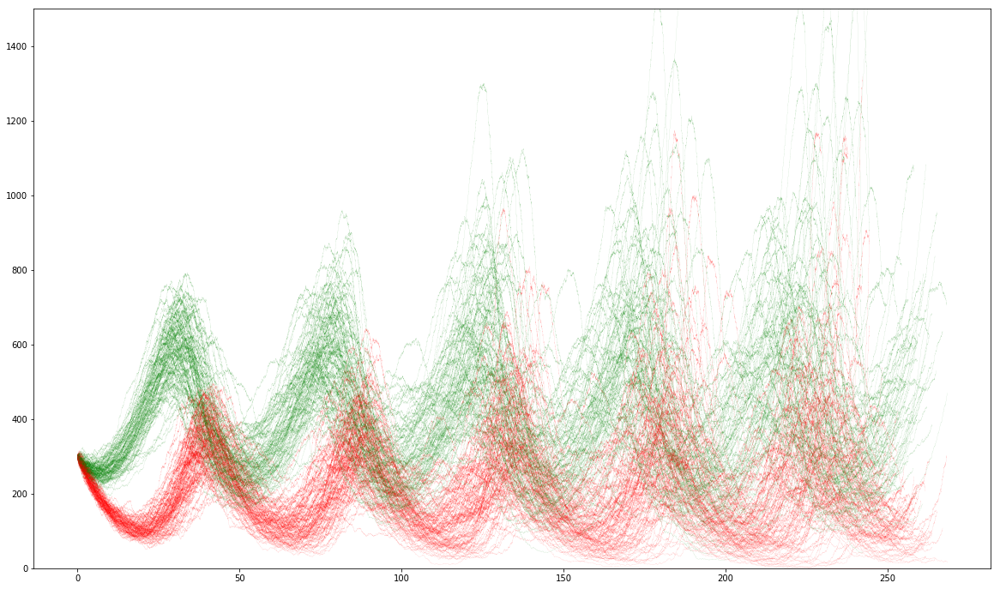

# TensorSim

> GPU accelerated stochastic simulation on TensorFlow!

## Mapping microscopic transitions

Consider a simple lotka volterra model consisting of prey, _X_, and predators, _Y_. Prey reproduce at rate _a_ and die when consumed by predators at rate, _βXY_. Predators reproduce proportional to the consumption of prey, _β_, and die at a constant rate _μ_. These assumptions give the following differential equations

<!--
$$
\begin{aligned}
\frac{dX}{dt} &= aX - \beta XY \\
\frac{dY}{dt} &= \beta XY - \mu Y
\end{aligned}
$$
-->

<p align="center">
  
</p>

We can represent this system as set of propensity transitions between discrete quantities of _X_ and _Y_


<!--
$$
\begin{aligned}
T(x+1,y | x,y) &= a \\
T(x-1,y+1 | x,y) &= \beta XY \\
T(x,y-1 | x,y) &= \mu
\end{aligned}
$$
-->

<p align="center">
  
</p>

These can be represented as a stoichiometric matrix, **S**, and propensity vector, **p**
<!--
$$
\mathbf{S} =
\begin{bmatrix}
    1  &  0  \\
    -1  & 1  \\
    0  &  1
\end{bmatrix}
$$
-->

<p align="center">
  
</p>

<!--
$$
\mathbf{p} = (a, \beta XY, \mu)
$$
-->

<p align="center">
  
</p>

## Example

```python
import numpy as np
import tensorflow as tf
import tensorsim as ts

n_reps = 100
X_t0, Y_t0 = 300., 300.
a, B, mu = 0.1, 0.0005, 0.2

with tf.Graph().as_default():

    # initial conditions
    ics = tf.constant([[X_t0]*n_reps, [Y_t0]*n_reps])

    # simulation parameters
    theta = tf.constant([[a],[B],[mu]])

    #stoichiometric matrix
    S = tf.constant([
        [ 1., 0.],
        [-1., 1.],
        [ 0.,-1.]
    ])

    #hazard function a.k.a propensity vector
    def h_fn(X, Y, a, B, mu):
        return [a*X, B*X*Y, mu*Y]

    Y = ts.integrate.mjp(ics, theta, S, h_fn, n_jumps=30000)

    with tf.Session() as sess:
        t, Z = sess.run(Y)

fig = pl.figure(figsize=(20,12))
for q in range(n_reps):
    # t@(n_jumps, n_reps) and Z@(n_jumps, n_var, n_reps)
    pl.plot(t[:,q], Z[:,0,q], "g-", t[:,q], Z[:,1,q], "r-", linewidth=0.05)
pl.ylim((0,1500))
```




## Supported Stochastic Integration Algorithms

* Gillespie Direct Method `tensorsim.integrate.mjp`
* Tau Leaping (coming soon)

## Installation

```
git clone https://github.com/leighton/tensorsim
cd tensorsim
conda env create --file conda.env.yaml
source activate tensorsim
python example/mjp.py
```
